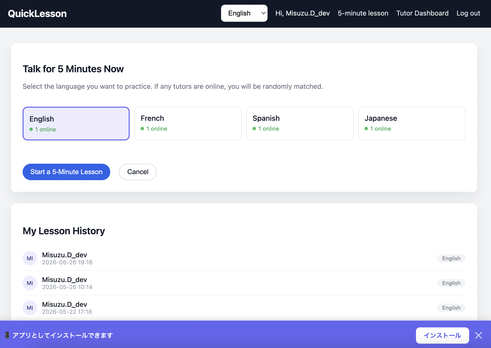
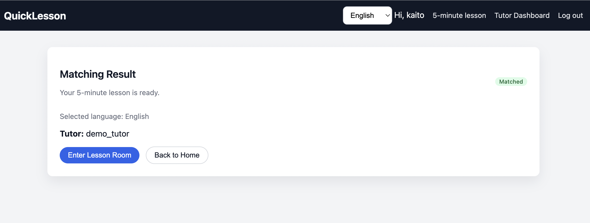
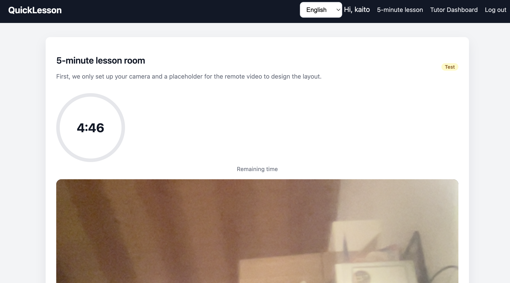
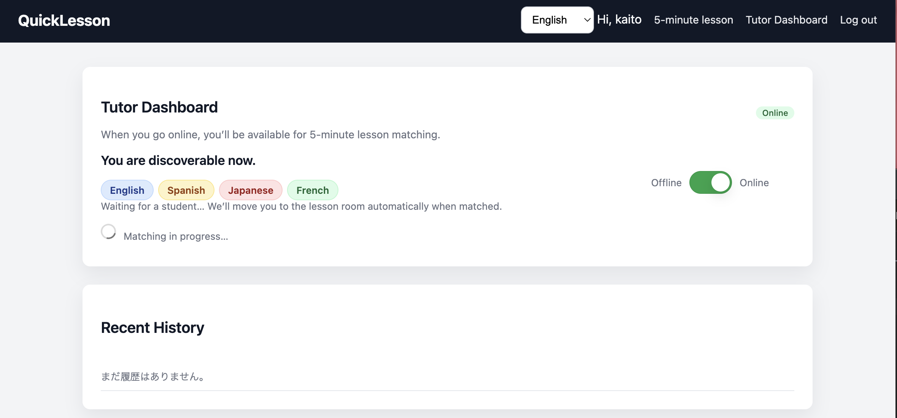
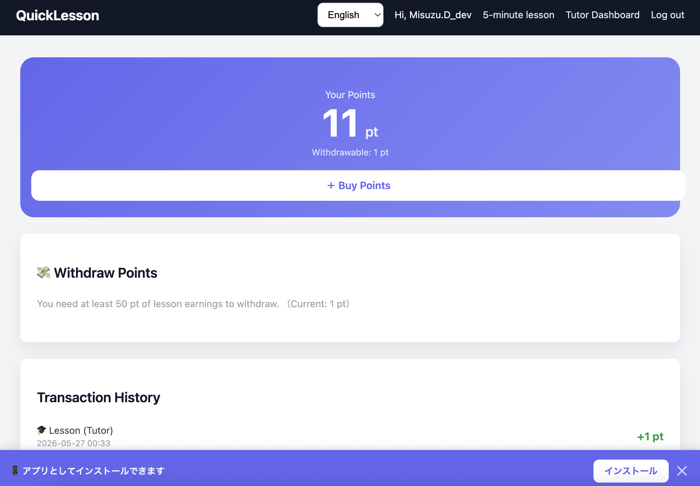

# QuickLesson — Django 5min Language App

A Django-based language exchange platform for quick 5-minute conversations.

Users can:
- Match with tutors or learners
- Start short language sessions
- Practice casually without long commitments


## Features

- User registration & login
- Student / Tutor roles
- Language selection
- Quick lesson matching
- 5-minute session timer
- Lesson room
- Lesson history
- Multilingual UI (JA / EN / ES / FR)
- 
**Live demo (development):** https://django-5min-languageapp.onrender.com/

## Screenshots

### Home Page



---

### Matching Page



---

### Lesson Room



---

### Tutor Dashboard



### Point Page




## Tech Stack

- Python
- Django
- SQLite
- HTML / CSS
- JavaScript
- Render (deployment)
- WebRTC


## Current Status

This project is currently under active development.
The goal is to build a lightweight language exchange platform focused on short and casual conversations.

### Current Approach
- Start with a Django monolith architecture
- Prioritize a working MVP before advanced optimization
- Keep templates focused on UI only
- Organize project structure early

### Backend
- Use Django for authentication, matching, sessions, and history
- Gradually migrate function-based views to CBV
- Prepare for future API integration with Django REST Framework (DRF)

### Frontend
- Learn basic JavaScript alongside development
- Focus on DOM manipulation and API communication (`fetch`)
- Improve UI progressively with JavaScript
- Consider Vue/Nuxt after the MVP phase

### MVP Priorities
- Authentication
- Matching flow
- Session room
- Lesson history
- Minimal but functional UI

### Future Plans
- Add DRF APIs
- Move toward SPA architecture
- Introduce TypeScript later if needed
- Support mobile apps using the same API

### Timezone Strategy
- Store timestamps in UTC
- Convert to local time only when displaying


# QuickLesson

## What is QuickLesson?

QuickLesson is a safety-focused language conversation platform built around one idea:

> Talk for 5 minutes. Learn. The session ends.

The platform is designed for short, structured language practice between students and approved tutors.

---

## Core Principles

- Student ↔ Approved Tutor only
- Strict 5-minute sessions
- No endless calls or random chatting
- No dating or social-media style interaction
- Focused language learning environment
- Moderation-first design

---

## Features

| Feature | Description |
|---|---|
| 5-Minute Talk Room | Timer-controlled sessions with automatic ending |
| Student & Tutor Modes | Different dashboards depending on user role |
| Language Selection | Japanese, English, Spanish, and French support |
| Clean UI | Simple mobile-friendly Bootstrap interface |
| Quick Matching | Students can instantly request short lessons |
| Lesson History | Minimal session tracking and history |

---

## Why It’s Different

| Typical Language Apps | QuickLesson |
|---|---|
| 30–60 minute lessons | Strict 5-minute sessions |
| Subscription models | Per-session style |
| Social/SNS atmosphere | Learning-focused only |
| Long-term commitment | Short and repeatable practice |
| Complicated tutor onboarding | Simple lightweight approval flow |

---

## Roles

Internal roles remain:

- `student`
- `tutor`
- `admin`

Localized UI labels are used depending on language.

---

## Benefits for Students

- Practice anytime in just 5 minutes
- Low-pressure learning experience
- Safe environment without DMs or social features
- Talk with real speakers worldwide
- Easy to repeat multiple short sessions

---

## Benefits for Tutors

- Teach in short sessions
- Flexible online/offline availability
- Meet motivated learners only
- Suitable for side income or teaching experience

---

## Current MVP Features

### Authentication & Roles
- Login / registration
- Student and tutor profiles

### Matching System
- Language-based lesson requests
- Online tutor matching
- Waiting queue with retry flow

### Lesson Sessions
- 5-minute lesson rooms
- Session timer
- Basic lesson history

### Admin Tools
- Language management
- User/profile management
- Tutor approval preparation

---

## Current Development Direction

- Django monolith architecture first
- Clean project structure early
- CBV-based refactoring
- Future DRF API support
- JavaScript learning alongside development
- Vue/Nuxt considered after MVP
- UTC-based timestamp management

---

## Future Plans

- Real WebRTC video sessions
- Moderation & reporting tools
- Credit/payment system
- SPA frontend architecture
- Mobile app support using shared APIs

---

## Change Language

```bash
python manage.py compilemessages
```


## Quick Start

```bash
pip install -r requirements.txt
python manage.py migrate
python manage.py createsuperuser
python manage.py runserver
