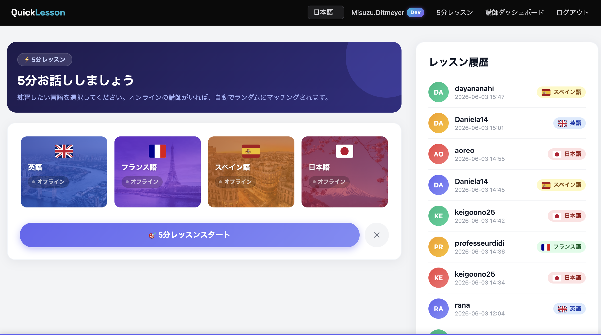
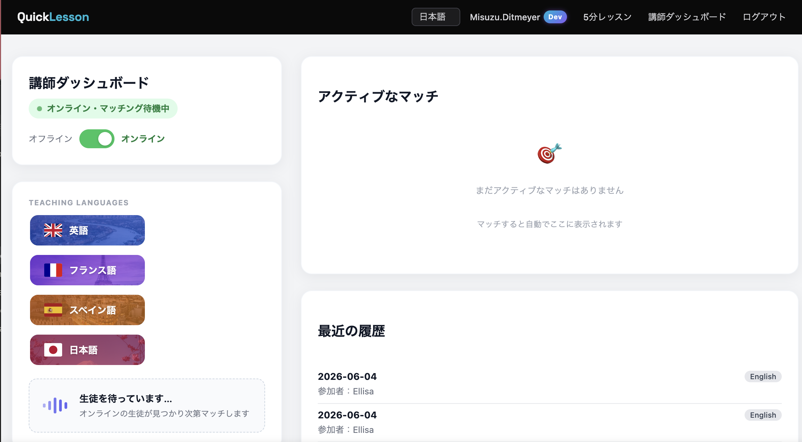
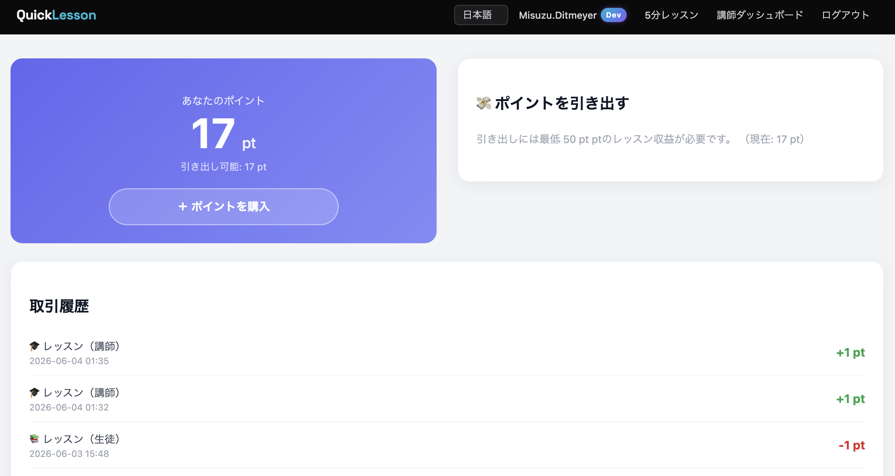

# 🚀 １50 Active Users Reached! 🚀

🚀 **12 Users Connected at the Same Time!** 🚀

## 🎯 Goal: 1000 Active Users by the End of This year 💯

A Django-based language exchange platform for quick 5-minute conversations.

Users can:
- Match with tutors or learners
- Start short language sessions
- Practice casually without long commitments


## Features

- User registration & login
- Student / Tutor roles
- Language selection
- Quick lesson matching
- 5-minute session timer
- Lesson room
- Lesson history
- Multilingual UI (JA / EN / ES / FR)
- 
**Live demo (development):** https://django-5min-languageapp.onrender.com/

## Screenshots

### Home Page



---

### Tutor Dashboard



### Point Page




## Tech Stack

- Python
- Django
- SQLite
- HTML / CSS
- JavaScript
- Render (deployment)
- WebRTC


# QuickLesson

## What is QuickLesson?

QuickLesson is a safety-focused language conversation platform built around one idea:

> Talk for 5 minutes. Learn. The session ends.

The platform is designed for short, structured language practice between students and approved tutors.

---

## Core Principles

- Student ↔ Approved Tutor only
- Strict 5-minute sessions
- No endless calls or random chatting
- No dating or social-media style interaction
- Focused language learning environment
- Moderation-first design

---

## Features

| Feature | Description |
|---|---|
| 5-Minute Talk Room | Timer-controlled sessions with automatic ending |
| Student & Tutor Modes | Different dashboards depending on user role |
| Language Selection | Japanese, English, Spanish, and French support |
| Clean UI | Simple mobile-friendly Bootstrap interface |
| Quick Matching | Students can instantly request short lessons |
| Lesson History | Minimal session tracking and history |

---

## Why It’s Different

| Typical Language Apps | QuickLesson |
|---|---|
| 30–60 minute lessons | Strict 5-minute sessions |
| Subscription models | Per-session style |
| Social/SNS atmosphere | Learning-focused only |
| Long-term commitment | Short and repeatable practice |
| Complicated tutor onboarding | Simple lightweight approval flow |


```bash
python manage.py compilemessages
```


## Quick Start

```bash
pip install -r requirements.txt
python manage.py migrate
python manage.py createsuperuser
python manage.py runserver
