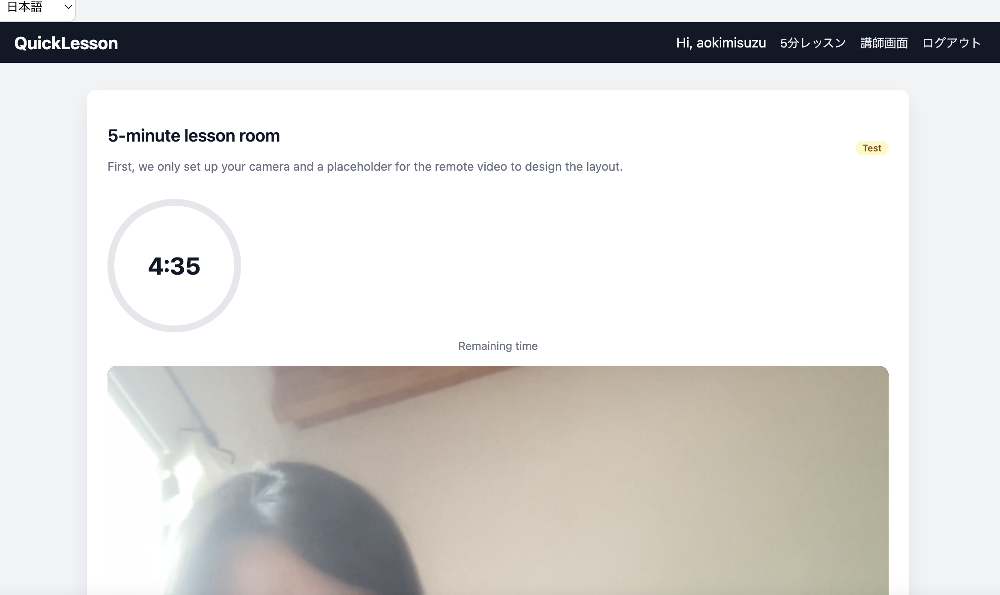

# QuickLesson — 5-Minute Online Language Lessons (WIP)
## Next Steps

### Django (main development)
- Refactor views into modules (split by feature)
- Refactor models if they grow
- Split settings into base / dev / prod
- Replace function-based views with class-based views (CBV)
- Fix duplicate view definitions (e.g. tutor_dashboard)
- Fix HTML structure (move form tags inside <body>)

### FastAPI
- Stop using it for frontend rendering
- Either:
  - use it only as an API, or
  - pause it for now

### Environment
- Create requirements.txt with pinned versions

### General
- Clean project structure early to avoid future issues
**Live demo (development):** https://django-5min-languageapp.onrender.com/
## Screenshots

### Dashboard




**Status:** 🚧 Heavy work in progress. Not production-ready.

## What is QuickLesson?

QuickLesson is a **safety-first language conversation platform** focused on:

- **Student ↔ Approved Tutor only**
- **Strict 5-minute lesson limit**
- No dating / erotic / casual chat misuse

> Talk for 5 minutes. Learn. The session ends.

---

## Core Principles

- ❌ No random user-to-user calls
- ❌ No long or endless sessions
- ✅ Short, focused language practice
- ✅ Built for moderation from day one

---
## 🎯 Features / 主な特徴

| Feature / 機能 | Description / 説明 |
|----------------|-------------------|
| 🕔 **5-Minute Talk Room / 5分トークルーム** | A timer-controlled 5-minute session that ends automatically. / タイマー付きで自動終了する5分間の練習部屋。 |
| 👩‍🏫 **Teacher & Student Modes / 先生・生徒モード** | Different dashboards depending on your role. / ロール選択でUIが変化。 |
| 🌍 **Language Selection / 言語選択** | Japanese, English, Spanish, French (multi-select for teachers). / 日本語・英語・スペイン語・フランス語に対応。 |
| 💬 **Clean Bootstrap UI / クリーンなUI** | Simple, mobile-friendly interface using Bootstrap 5. / Bootstrap 5で構築したシンプルなUI。 |
| 💻 **Run Locally / 即起動可能** | Runs instantly with FastAPI and SQLite. / FastAPI + SQLiteで動作、追加設定不要。 |

---


## Roles (UI labels)

Internal system roles remain `student / tutor / admin`.

| Language | Waiting side | Joining side |
|---|---|---|
| Japanese | 相手役 | 参加者 |
| English | Partner | Guest |
| Spanish | Guía | Participante |
| French | Guide | Participant |

---

## 👨‍🎓 For Students / 生徒の利点

- 🎯 Practice anytime for **just 5 minutes**  
- 💸 Low cost or free (prototype phase)  
- 😌 100% safe — no DMs or “social” elements  
- 🌍 Talk to real speakers, globally  
- 🔁 Rate “Bad” to never match with someone again  

> **短く・安心して・何度でも練習できる。**

---

## 👩‍🏫 For Teachers / 先生の利点

- 💰 Teach for 5 minutes — perfect for side income or experience  
- 🕒 Go online/offline anytime  
- 💬 Meet motivated learners only  
- 🎓 Great for student teachers or native speakers who want to help others  

> **"Teach in 5 minutes" — a new micro-teaching style.**

---
## 💡 Why It’s Different / 他との違い

| 項目 | 一般的な言語学習サービス | 5min Talk |
|------|---------------------------|------------|
| セッション時間 | 30分〜60分 | **5分だけ** |
| 料金体系 | 月額・サブスク | **1回ごと（チケット制予定）** |
| 雰囲気 | SNS寄り・雑談多め | **完全学習特化・出会い要素ゼロ** |
| 先生登録 | 審査制・面倒 | **即登録OK・自由** |
| 継続性 | 長期前提 | **短時間×高頻度スタイル** |

---

## Tech Stack (MVP)

- Python / Django
- SQLite (dev only)
- Server-rendered templates + lightweight custom CSS

---

## Current Features (MVP)

### Models

- **LessonLanguage** — supported languages  
- **StudentProfile** — minimal student profile  
- **TutorProfile**
  - supported languages (ManyToMany)
  - `is_online`
  - `can_interview`
  - *(planned)* `is_approved`
- **QuickLessonRequest**
  - lesson request (`waiting / matched / cancelled`)
  - `purpose`: `lesson / interview`
- **QuickLessonMatch**
  - who matched with whom
  - `started_at / end_at` (5-minute slot)
  - `price` (future credits)
  - room metadata (future WebRTC)

---

## Current Flow (MVP)

### Student

1. Login
2. Select a language
3. Request a 5-minute lesson
4. Backend searches for tutors that are:
   - online
   - approved
   - compatible with the requested language
5. If matched → lesson room
6. If not → waiting screen with auto-retry

### Tutor

1. Login
2. Open `/tutor/dashboard/`
3. Toggle online/offline
4. Get matched automatically
5. View recent lesson history (minimal)

### Admin (current)

- Django Admin:
  - manage languages
  - create users
  - link profiles
- Planned:
  - role management
  - tutor approval workflow

---

## Roadmap (short)

- Enforce strict **Student ↔ Tutor only** logic everywhere
- Real **5-minute enforcement** (server + client)
- In-browser **WebRTC video**（Daily Prebuilt）
- Admin monitoring & recording
- Reports / bans / moderation tools
- Credit-based payments (anti-abuse)

---

## Quick Start

```bash
pip install -r requirements.txt
python manage.py migrate
python manage.py createsuperuser
python manage.py runserver
