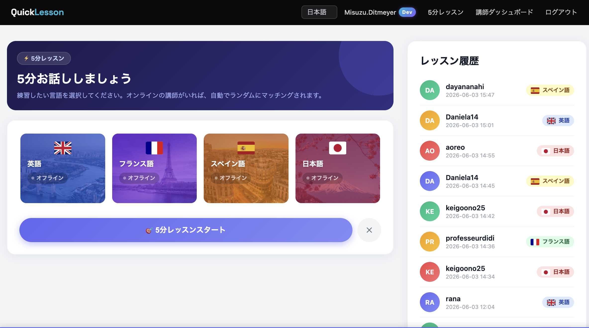
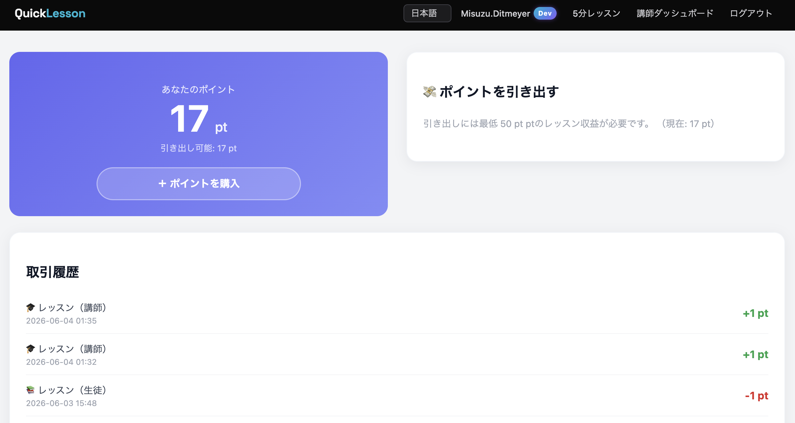

# QuickLesson

A web application that makes language speaking practice simple through short, real-time conversations with native speakers.

🌐 Live Demo: https://django-5min-languageapp.onrender.com/
📄 Status: Active Development

---

## Overview

QuickLesson is a language exchange platform designed for learners who want to improve their speaking skills without committing to long lessons.

Instead of one-hour sessions, users join 5-minute conversations with native speakers whenever they have time.

---

## Features

- 🌍 Multiple languages (Japanese, English, Spanish, French)
- 🎥 Real-time video calls
- 👩‍🏫 Native speaker matching
- ⭐ Tutor ratings
- 📖 Session history
- 👤 User profiles
- 📱 Responsive design

---

## Tech Stack

### Backend
- Django
- Django REST Framework
- PostgreSQL

### Frontend
- HTML
- CSS
- JavaScript

### Deployment
- Render

---

## Screenshots

| Home | point |
|------|------------|
|  |  |

---

## Project Structure

```
quicklesson/
├── accounts/
├── lessons/
├── tutors/
├── chat/
├── static/
├── templates/
└── manage.py
```

---

## Installation

```bash
git clone ...
cd quicklesson
pip install -r requirements.txt
python manage.py migrate
python manage.py runserver
```

---

## Roadmap

- [x] Authentication
- [x] Video calls
- [x] Tutor dashboard
- [ ] AI feedback
- [ ] Mobile app
- [ ] Push notifications

---

## About the Project

QuickLesson is a personal project that I continue to develop while collecting feedback from real users.

The goal is to make language speaking practice accessible, flexible, and enjoyable through short conversations.
