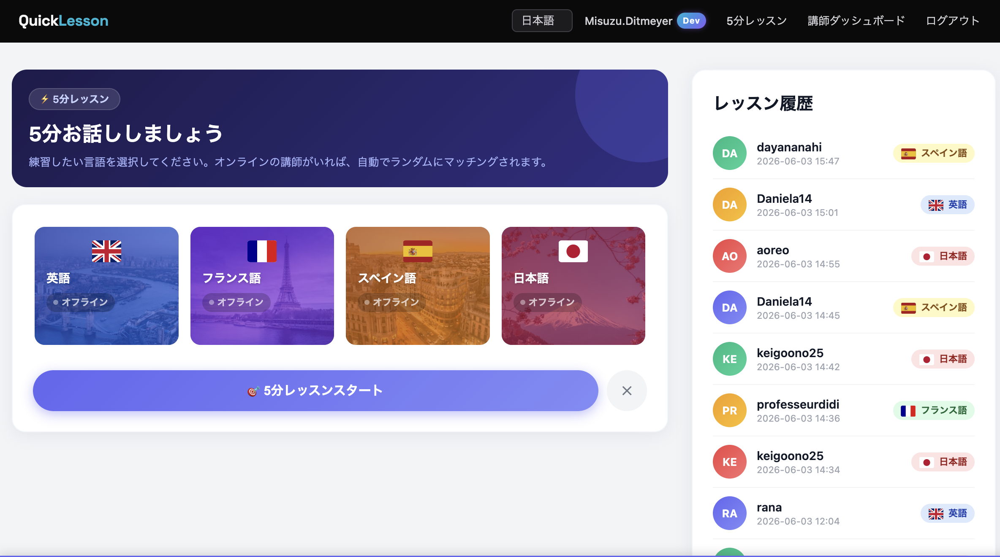
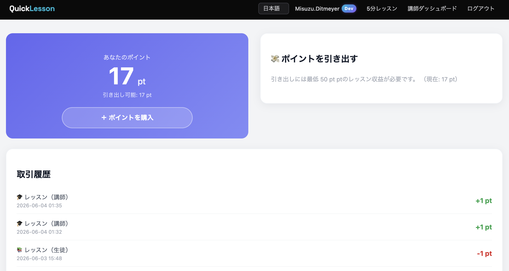

# QuickLesson

A web application that makes language speaking practice simple through short, real-time conversations with native speakers.

🌐 Live Demo: https://django-5min-languageapp.onrender.com/
📄 Status: Active Development

---

## Overview

QuickLesson is a language exchange platform designed for learners who want to improve their speaking skills without committing to long lessons.

Instead of one-hour sessions, users join 5-minute conversations with native speakers whenever they have time.

---

## Features

- 🌍 Multiple languages (Japanese, English, Spanish, French)
- 🎥 Real-time video calls
- 👩‍🏫 Native speaker matching
- ⭐ Tutor ratings
- 📖 Session history
- 👤 User profiles
- 📱 Responsive design

---

## Tech Stack

### Backend
- Django
- Django REST Framework
- PostgreSQL

### Frontend
- HTML
- CSS
- JavaScript

### Deployment
- Render

---

## Screenshots

| Home | point |
|------|------------|
|  |  |

---

## Project Structure

```
quicklesson/
├── accounts/
├── lessons/
├── tutors/
├── chat/
├── static/
├── templates/
└── manage.py
```

---

## Installation

```bash
git clone ...
cd quicklesson
pip install -r requirements.txt
python manage.py migrate
python manage.py runserver
```

---

## Roadmap

- [x] Authentication
- [x] Video calls
- [x] Tutor dashboard
- [ ] AI feedback
- [ ] Mobile app
- [ ] Push notifications

---

## About the Project

QuickLesson is a personal project that I continue to develop while collecting feedback from real users.

The goal is to make language speaking practice accessible, flexible, and enjoyable through short conversations.

## Next-conversation questions

After a tutor saves a note, the server generates five questions using OpenAI's
Responses API (`gpt-4.1-mini` by default). Only the same student's latest five
notes in the lesson language are included. The current CEFR level, or the latest
specified level in that history, controls difficulty. No account names or emails
are added to the request. Note text itself is sent to OpenAI; `store` is false.

Questions are saved on the note and shown below the tutor guide in the next
lesson. Opening the room never generates questions. Repeated submissions for the
same match reuse the first saved note and do not generate again. API failures,
missing keys, or missing levels leave the note saved without suggestions; no
automatic retry is performed. A save may wait up to the HTTP timeout (8 seconds).

Local development reads `OPENAI_API_KEY` from the ignored `.env.local` file if
it is not already in the environment. Production requires `OPENAI_API_KEY` in the
hosting service's secret environment settings. Never commit the env file or key.
`OPENAI_QUESTION_MODEL` may override the model. Run `python manage.py migrate`
after deployment to add the question fields (the existing build script does this).
Existing notes are not automatically sent to the API or backfilled.
